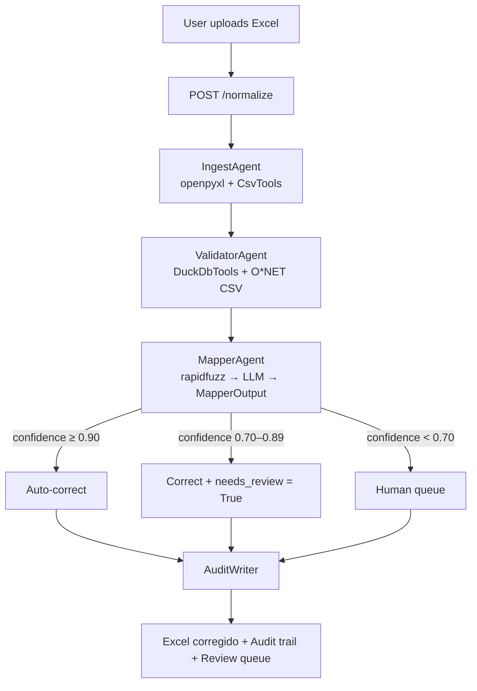

# Documentation Audit — py-agno-ai-workflow
# Version 2 — Corrections Applied + Epistemic Review

## Status

Decisions D1–D7 are final and authoritative.
Gaps G1–G5 are still open and block onboarding — they are not resolved by this document.
This document is authoritative on **decisions**, not on **implementation state**.

> Legend:
> - `[CONFIRMED]` — validated design decision, treat as fixed
> - `[PROVISIONAL]` — reasonable default, must be re-evaluated after implementation
> - `[INTENDED]` — describes desired behavior, not yet verified in code

---

## Decisions Made (replaces all Version 1 ambiguities)

### D1 — Tier 0.70–0.89 behavior (resolves I4)
**Decision: Option A.** `[CONFIRMED]`

The LLM applies the correction AND marks it `needs_review = True`.
The user receives a mostly-complete Excel. Flagged rows are visible in the audit trail
and reversible via `POST /review/{id}/reject`.
This is the correct behavior in `CLAUDE.md`, `07`, and `08`. Any other wording is wrong.

---

### D2 — `teams/` folder (resolves I2)
**Decision: Delete it.** `[CONFIRMED]`

The project uses a sequential Workflow. The Team pattern adds no value here —
dynamic routing is not needed when the flow is always Ingest → Validate → Map → Audit.
Remove `teams/` from the scaffold in `02-project-structure.md` and from the repo.

---

### D3 — `rapidfuzz` is mandatory (resolves I3)
**Decision: mandatory pre-filter, not optional.** `[CONFIRMED]`

`rapidfuzz` runs before every LLM call. Score ≥ 0.90 → automatic correction, no tokens spent.
Score 0.70–0.89 → passes to LLM for semantic evaluation. Score < 0.70 → human-in-the-loop.
Remove the "contradicting earlier doc" note from `06`. Fix `04` to match this.

> **[PROVISIONAL] Thresholds 0.70 / 0.89 are initial estimates, not empirically validated.**
> They are reasonable defaults for O*NET occupation title matching, but must be
> re-calibrated after running `evaluation/test_agent_accuracy.py` against a labeled sample.
> Do not treat these numbers as final until eval results confirm them.

---

### D4 — MapperOutput Pydantic schema (resolves C1, C2)
**Decision: defined here, canonical.** `[CONFIRMED]`

```python
from pydantic import BaseModel, Field

class MapperOutput(BaseModel):
    original: str = Field(description="Category exactly as it came in the input")
    corrected: str = Field(description="Matched canonical category from valid_categories.csv")
    confidence: float = Field(ge=0.0, le=1.0, description="Confidence score 0–1")
    needs_review: bool = Field(description="True if human should verify (tier 0.70–0.89)")
    method: str = Field(description="One of: rapidfuzz | llm | human")
    normalization_type: str = Field(
        description="One of: typo | synonym | language | format | abbreviation | case | unknown"
    )
```

All four agents must use `output_schema` with a Pydantic v2 model. This is a hard invariant.

---

### D5 — Audit log column schema (resolves C3)
**Decision: defined here, canonical.** `[CONFIRMED]`

| Column | Type | Description |
|--------|------|-------------|
| `run_id` | str | UUID of the workflow run |
| `row_index` | int | Row number in the original Excel |
| `original` | str | Value as uploaded |
| `corrected` | str | Final value after normalization |
| `confidence_score` | float | Score from rapidfuzz or LLM |
| `normalization_type` | str | typo / synonym / language / format / abbreviation / case / unknown |
| `method` | str | rapidfuzz / llm / human |
| `needs_review` | bool | Whether human review was flagged |
| `reviewed_by` | str / null | Human reviewer ID if applicable |
| `timestamp` | datetime | UTC timestamp of correction |

---

### D6 — Excel delivery sequence (resolves C4)
**Decision: Excel is delivered immediately after the workflow run.** `[CONFIRMED]`

The corrected Excel contains automatic corrections (confidence ≥ 0.90) already applied.
Tier 0.70–0.89 corrections are applied but flagged. Items with confidence < 0.70 are left
unchanged and listed in the review queue. The human resolves the queue separately — the
initial Excel download does not wait for human review.

---

### D7 — Cloud provider context (new — not in Version 1)

> **Note: This decision contains two distinct types of content — keep them separate.**

#### Technical fact `[CONFIRMED]`
The project uses Groq for cloud inference (free tier, sufficient for portfolio).
`infrastructure/llm/provider.py` abstracts the provider client behind a single config value.
Swapping to a different provider requires changing `ENV` and the relevant API key in `.env`.
No other code changes are needed.

Target providers for production:

| Provider | AI Service | Market position |
|----------|-----------|-----------------|
| AWS | Bedrock (Claude, Llama, Titan) | 31% cloud market share — most enterprise jobs |
| Azure | Azure OpenAI Service | 24% market share — dominant in enterprise/Microsoft stack |
| GCP | Vertex AI (Gemini, Llama) | 12% market share — strongest in AI/ML native workloads |

#### Portfolio framing *(not a technical specification — do not use for implementation decisions)*
"Designed for multi-cloud deployment. Currently running on Groq.
Swap-ready for AWS Bedrock or Azure OpenAI via `infrastructure/llm/provider.py`."

---

## Remaining Gaps — Priority 1 (block onboarding — still open)

These were not resolved by decisions above. They require file creation.

### G1 — `pyproject.toml` does not exist
This is the first thing to create before any code. Use the dependency list from
`06-stack-and-dependencies.md`. Without this, `uv sync` fails immediately.

Required file: `pyproject.toml`

```toml
[project]
name = "py-agno-ai-agents"
version = "0.1.0"
requires-python = ">=3.12"

dependencies = [
    "agno>=1.0",
    "openai",
    "pydantic>=2.0",
    "fastapi",
    "uvicorn",
    "chainlit",
    "pandas",
    "openpyxl",
    "rapidfuzz",
    "duckdb",
    "sqlalchemy",
    "psycopg[binary]",
    "aiosqlite",
    "python-dotenv",
]

[dependency-groups]
dev = [
    "pytest",
    "pytest-asyncio",
    "httpx",
    "ruff",
]

[tool.ruff]
line-length = 100
target-version = "py312"

[tool.pytest.ini_options]
asyncio_mode = "auto"
```

---

### G2 — `.env.example` does not exist
Without this, any developer (including yourself in 3 weeks) must read source code
to know what environment variables are required.

Required file: `.env.example`

```
# Model provider: "development" uses LMStudio locally, "production" uses Groq
ENV=development

# LMStudio — local inference server
# Default port when running LMStudio: 1234
LM_STUDIO_BASE_URL=http://localhost:1234/v1
LM_STUDIO_MODEL_ID=llama-3.2-3b

# Groq — cloud inference (used when ENV=production)
GROQ_API_KEY=your_groq_api_key_here
GROQ_MODEL_ID=llama-3.3-70b-versatile

# Optional: future swap to AWS Bedrock, Azure OpenAI, or GCP Vertex AI
# AWS_BEDROCK_REGION=us-east-1
# AZURE_OPENAI_ENDPOINT=https://your-resource.openai.azure.com/
# AZURE_OPENAI_KEY=your_key_here
```

---

### G3 — No quickstart in README.md
README currently says "Active development." It must contain runnable commands.

Required block to add to `README.md`:

```markdown
## Quickstart

### Prerequisites
- Python 3.12+
- [uv](https://docs.astral.sh/uv/) installed
- LMStudio running locally on port 1234 (for development)
  - Load any OpenAI-compatible model (llama-3.2-3b recommended)

### Setup

git clone <repo-url>
cd py-agno-ai-agents

# Install dependencies
uv sync

# Configure environment
cp .env.example .env
# Edit .env with your values

# Generate valid categories dataset
uv run python scripts/build_valid_categories.py

# Start the Chainlit UI
uv run chainlit run main.py --port 8000

# Start FastAPI (separate terminal)
uv run uvicorn api.routes:app --reload --port 8001

# Run tests
uv run pytest evaluation/ -v

# Run linter
uv run ruff check . && uv run ruff format .
```

---

### G4 — `scripts/build_valid_categories.py` undocumented
This script is the foundation of the entire system. Document it.

Add to `README.md` or a `scripts/README.md`:

```
scripts/build_valid_categories.py

Input:  Related Occupations.xlsx (place at project root — download from O*NET)
        Source: https://www.onetcenter.org/database.html
Output: data/valid_categories.csv (923 unique canonical occupation titles)

When to re-run:
- When O*NET releases a new version of the dataset
- When data/valid_categories.csv is missing or corrupted

How to run:
uv run python scripts/build_valid_categories.py
```

---

### G5 — Edge cases not documented
`[INTENDED — not yet implemented. Verify each behavior after the corresponding step in Implementation Order.]`

Add to `CLAUDE.md` under a new "Edge Cases" section:

| Situation | Intended system behavior | Verify after step |
|-----------|--------------------------|-------------------|
| Excel has no recognizable target column | `IngestAgent` returns error; FastAPI returns 400 with message | Step 3 |
| Excel file is malformed or corrupted | `openpyxl` raises exception; caught and returned as 422 | Step 3 |
| LMStudio is unreachable | `provider.py` raises connection error; returned as 503 with retry suggestion | Step 5 |
| Review queue is empty | `GET /review-queue` returns empty list `[]`, not 404 | Step 8 |
| All categories already valid | Workflow completes with zero corrections; audit trail still generated | Step 7 |

> These describe **intended** behavior agreed upon in design. None of it is verified until the
> corresponding implementation step is complete and tested. Do not treat this table as a
> contract until each row has a passing test.

---

## Remaining Gaps — Priority 2 (inconsistencies — resolved by decisions above)

| ID | Issue | Resolution |
|----|-------|------------|
| I1 | `05-agno-sdk-reference.md` missing from `CLAUDE.md` | Add it to the reference table |
| I2 | `teams/` contradicts design decision | **Deleted** (Decision D2) |
| I3 | rapidfuzz mandatory vs optional | **Mandatory** (Decision D3) |
| I4 | Tier 0.70–0.89 behavior inconsistent | **Option A** (Decision D1) |
| I5 | Layer 0/1/2 terminology in one file only | Rename to "rapidfuzz tier / LLM tier / human tier" throughout |

---

## Remaining Gaps — Priority 3 (missing content — resolved by decisions above)

| ID | Issue | Resolution |
|----|-------|------------|
| C1 | `output_schema` never shown with example | **MapperOutput defined** (Decision D4) |
| C2 | LLM output type at 0.70–0.89 undefined | **Returns MapperOutput** (Decision D4) |
| C3 | Audit log schema never defined | **Defined** (Decision D5) |
| C4 | Excel delivery sequence ambiguous | **Immediate delivery** (Decision D6) |

---

## Redundancies — still pending cleanup

These do not block development but should be cleaned up before the project is published.

| ID | Issue | Fix |
|----|-------|-----|
| R1 | 7 normalization types appear in 4 places | Centralize in `07`; replace others with one-line cross-reference |
| R2 | Confidence thresholds appear in 3 places | Centralize in `07`; reference from `CLAUDE.md` and `08` |
| R3 | Stack table duplicated in `CLAUDE.md` and `06` | Keep in `06`; replace in `CLAUDE.md` with "see `06-stack-and-dependencies.md`" |
| R4 | Architecture flow duplicated 5 times as plain text | Replace all with one Mermaid diagram in `04`; reference elsewhere |

Recommended Mermaid diagram for `04`:



---

## Implementation Order (unchanged from pre-audit recommendation)

Build and test each agent in isolation before connecting the next:

1. `pyproject.toml` + `.env.example` — environment must work before any code
2. `scripts/build_valid_categories.py` — data foundation must exist
3. `IngestAgent` — no LLM, just openpyxl + CsvTools; easiest to isolate and test
4. `ValidatorAgent` — DuckDbTools over O*NET CSV; still no LLM
5. `MapperAgent` — rapidfuzz + LLM + MapperOutput schema; core of the project
6. `AuditWriter` — CsvTools write + audit log schema
7. `normalization_workflow.py` — connect all four steps
8. `api/routes.py` — FastAPI endpoints + review queue logic
9. Chainlit UI — wire to FastAPI
10. `evaluation/test_agent_accuracy.py` — AccuracyEval + pytest suite
11. Docker + deploy to Render/Railway
