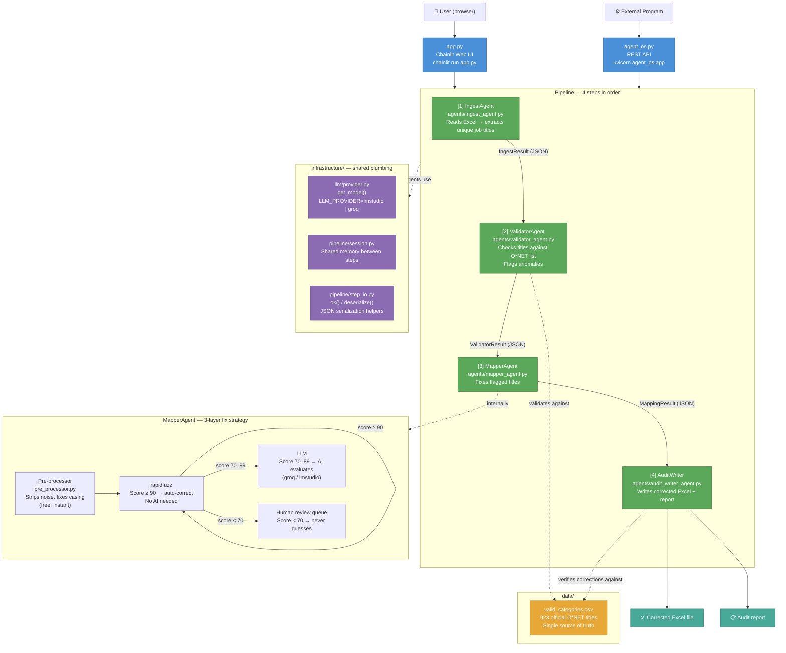

```mermaid
flowchart TD
    %% Entry Points
    USER["👤 User (browser)"]
    PROG["⚙️ External Program"]

    APP["app.py\nChainlit Web UI\nchainlit run app.py"]
    API["agent_os.py\nREST API\nuvicorn agent_os:app"]

    USER --> APP
    PROG --> API

    %% Pipeline
    APP --> PIPELINE
    API --> PIPELINE

    subgraph PIPELINE["Pipeline — 4 steps in order"]
        direction TB

        S1["[1] IngestAgent\nagents/ingest_agent.py\nReads Excel → extracts unique job titles"]
        S2["[2] ValidatorAgent\nagents/validator_agent.py\nChecks titles against O*NET list\nFlags anomalies"]
        S3["[3] MapperAgent\nagents/mapper_agent.py\nFixes flagged titles"]
        S4["[4] AuditWriter\nagents/audit_writer_agent.py\nWrites corrected Excel + report"]

        S1 -->|"IngestResult (JSON)"| S2
        S2 -->|"ValidatorResult (JSON)"| S3
        S3 -->|"MappingResult (JSON)"| S4
    end

    %% Mapper detail
    subgraph MAPPER["MapperAgent — 3-layer fix strategy"]
        direction LR
        PRE["Pre-processor\npre_processor.py\nStrips noise, fixes casing\n(free, instant)"]
        FUZZ["rapidfuzz\nScore ≥ 90 → auto-correct\nNo AI needed"]
        LLM_LAYER["LLM\nScore 70–89 → AI evaluates\n(groq / lmstudio)"]
        HUMAN["Human review queue\nScore < 70 → never guesses"]

        PRE --> FUZZ
        FUZZ -->|"score ≥ 90"| FUZZ
        FUZZ -->|"score 70–89"| LLM_LAYER
        FUZZ -->|"score < 70"| HUMAN
    end

    S3 -.->|"internally"| MAPPER

    %% Outputs
    S4 --> OUT1["✅ Corrected Excel file"]
    S4 --> OUT2["📋 Audit report"]

    %% Shared infrastructure
    subgraph INFRA["infrastructure/ — shared plumbing"]
        PROV["llm/provider.py\nget_model()\nLLM_PROVIDER=lmstudio | groq"]
        SESSION["pipeline/session.py\nShared memory between steps"]
        STEPIO["pipeline/step_io.py\nok() / deserialize()\nJSON serialization helpers"]
    end

    PIPELINE -.->|"all agents use"| INFRA

    %% Data
    subgraph DATA["data/"]
        CSV["valid_categories.csv\n923 official O*NET titles\nSingle source of truth"]
    end

    S2 -.->|"validates against"| CSV
    S4 -.->|"verifies corrections against"| CSV

    %% Style
    classDef entry fill:#4A90D9,color:#fff,stroke:#2C5F8A
    classDef step fill:#5BA85A,color:#fff,stroke:#3A7039
    classDef infra fill:#8B6BB1,color:#fff,stroke:#5E4780
    classDef data fill:#E8A838,color:#fff,stroke:#B07820
    classDef output fill:#48A999,color:#fff,stroke:#2D6E66

    class APP,API entry
    class S1,S2,S3,S4 step
    class PROV,SESSION,STEPIO infra
    class CSV data
    class OUT1,OUT2 output
```